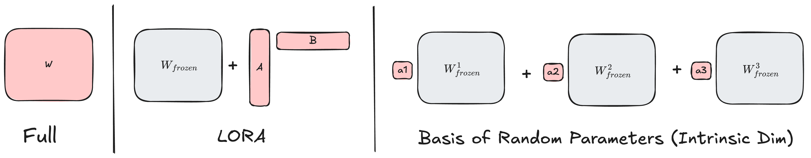

This post is the result of an afternoon detour spiraled from a joke over lunch: could one train a LLM with only 5 parameters (in the spirit of [Von Neumann's elephant](https://en.wikipedia.org/wiki/Von_Neumann%27s_elephant))? 5 parameters is of course silly,but there's an underlying real concern here: do we really need hundreds of billions of parameters in a language model, or is it just an artifact of how we've learned to train deep models? A lot of serious work has been done in earnest to study this question, including on model distillation, sparse pruning, quantization, low-rank adaptation, and more. But this blog post is just a quick look at some more light-hearted approaches.

## What is a 5-parameter language model???

Our goal will be to optimize a language model parameterized by $d$ parameters (where $d$ is a really small number) for next-token prediction. No cheating allowed by starting with pre-trained weights -- everything must be learned from scratch.

How do we do this? We could use a small custom architecture with few params, but we know that the Transformer architecture works, and a lot of effort has gone into optimizing it. Instead, we'll try to reparameterize the same large transformer architecture, just with fewer trainable parameters.

By default, any parameter $W \in \mathbb{R}^{m times n}$ in a transformer (e.g. the dense layer) "costs" $mn$ parameters (for a single dense layer, this is like 2 million params for GPT2, and 800 million params (!!) for LLAMA 405B). One way to reduce the number of trainable parameters is [LoRA](https://huggingface.co/docs/peft/main/en/conceptual_guides/lora), which splits this parameter into a random initialized (and fixed) matrix $W_{frozen}$ and a learned low-rank approximation $AB$.

$$\mathbf{W} = \mathbf{W_{frozen}} + \underbrace{\mathbf{A}}_{M \times r} \underbrace{\mathbf{B}}_{r \times N}$$

where $\mathbf{A} \in \mathbb{R}^{m \times r}$ and $\mathbf{B} \in \mathbb{R}^{r \times n}$ are our new learnable parameters. This drastically reduces the number of parameters (e.g. with common settings, 30k for GPT2 and 500k for LLAMA 405B), but is still way higher than our desired goal of 5 parameters.

For our much lower budget, we'll instead define our weights as a linear combination of $d$ random matrices:

$$\mathbf{W} = \alpha_1 \mathbf{W}_{frozen}^1 + \alpha_2 \mathbf{W}_{frozen}^2 + \ldots + \alpha_d \mathbf{W}_{frozen}^d$$

where $\alpha_1, \alpha_2, \dots, \alpha_d$ are our new learnable parameters, and these matrices $\mathbf{W}_{frozen}^k$ are randomly initialized parameters.

This formulation relates to a line of research studying the **intrinsic dimensionality** of neural networks, which posits that one doesn't need to optimize over *all* the dimensions of the parameter space to get low loss. The idea was popularized by [Li et al, 2018](https://arxiv.org/pdf/1804.08838) for ConvNets, and was also explored to some degree of success in finetuning LLMs by [Aghajanyan et al, 2020](https://arxiv.org/abs/2012.13255).

Here's a figure to illustrate

### Off to the Races!

To test our networks, I pre-trained a GPT2 model on the *C4 dataset* for roughly 1B tokens, with these different dimensionality reduction schemes based off of [this nice example pre-training script from Huggingface](https://github.com/huggingface/transformers/blob/main/examples/flax/language-modeling/run_clm_flax.py). I chose to not count embedding parameters in our budget, so that all the models learn something -- so the \# being counted is the number of *non-embedding parameters*.

I did no hyperparameter tuning was done, so take the raw numbers with a grain of salt.

<figure>

<figcaption aria-hidden="true">The Plot</figcaption>
</figure>

Some notes:
- The 5 parameter model is not able to learn anything at all (it's completely hidden by the baseline of only training embeddings) This is not surprising, but it's still a bit sad.
- The ordering is as expected: the full model performs the best, followed by the LoRA model (20M params), followed by the 5-parameters-per-layer (2K params), followed by the 5-parameter model (5 params).
- There is a *giant* gap in performance between the full parameterization and any of the reduced models. Reducing this is an active area of research, and I'm not surprised that we're not able to get close to the full model's performance.
- I was a little surprised how good the performance is of the model that allots 5 parameters to each layer (which only has 1000 params!).

### FAQ

1.  **What are the advantages of this basis parameterization?** Honestly, not much. It's harder to implement, slower, and less performant. The one main advantage is that the memory footprint of the model is much smaller, since the exemplar weights $\mathbf{W}_{frozen}^k$ never need to be stored anywhere -- they can be generated on-the-fly when requested so long as your hold onto the rng seed. (there's a caveat to this, see [Parameter scaling](#parameter-scaling) below). For most real cases where you're not trying to squeeze into \< 1000 params, LoRA is practical and better.

2.  **Is basis parameterization the same as LoRA?** No, but it's subtle. This method optimizes over a low-rank subspace of the parameter space, and LoRA optimizes over the space of low-rank functions. LoRA forces the learned embeddings to a lower-dimensional representation, and then up-projects them to the full space. This method always keeps the embeddings in the original space, so in theory if we kept the number of trainable parameters the same, this method should be more expressive. Check the figure above for a visual view.

3.  **What might have gone wrong?** In this low-parameterization regime, it seems the method is a little fickle to how the linear combination was instantiated (e.g. how is $\alpha_i$ initialized, how is each $\mathbf{W}_{frozen}^i$ initialized). I didn't have time to investigate this further, but I suspect that this is the main reason why the 5-parameter model failed to learn anything, and why the 5-parameters-per-layer model performed poorly as well.

### Parameter scaling

The keen reader might notice that retrieving the weights $\mathbf{W}$ requires initializing $d$ random matrices $\mathbf{W}_{frozen}^i$ (although, thankfully not storing them). This is fine if $d=5$, but what if we want to scale this up to $d=1000$? For each dense layer in GPT2, this would be initializing 2B parameters! This is a non-starter!

One really clever way to get around this is the [FastFood transform](https://proceedings.mlr.press/v28/le13.pdf), which I discovered through [Li et al, 2018](https://arxiv.org/pdf/1804.08838) and [Aghajanyan et al, 2020](https://arxiv.org/abs/2012.13255).

For setup, let's flatten $W$ to be a vector in $\mathbb{R}^{mn}$, and suppose that our initializer was normally distributed, then we can write
$$\mathbf{W} = \underbrace{\mathbf{X}}_{mn \times d}
\alpha ~~~~~\text{where } X = \begin{bmatrix}
\mathbf{W}_{frozen}^1 \\
\mathbf{W}_{frozen}^2 \\
\vdots \\
\mathbf{W}_{frozen}^d
\end{bmatrix}$$

Then, $\mathbf{X}$ is a Gaussian matrix, and computing the parameters is equivalent to computing $\mathbf{X}\alpha$. Can we do this without materializing this giant $mn \times d$ matrix?

Not exactly, but we can *approximately* by replacing $\mathbf{X}$ with a new matrix $\mathbf{X}'$ that "looks Gaussian" but can be much easier to compute. The best approximation used by the FastFood transform is a little complicated to summarize (check out the paper!), so I'll describe the simpler "FFT Fastfood" approximation:

$$\mathbf{X} \approx \Pi \mathbf{F} \mathbf{B}$$

where $\mathbf{F}$ is the Fourier transform matrix, $\mathbf{B}$ is a random sign matrix (i.e. diagonal with entries $\{-1, 1\}$), and $\Pi$ is a random permutation matrix. Computing $\mathbf{X'}\alpha$ is then equivalent to computing first randomly flipping the signs of $\alpha$, then applying the discrete Fourier transform, and finally permuting the rows of the result.

### What's the Takeaway?

OK, so we can't train a language model with 5 parameters. And also not with 1000 parameters. Or with 1M parameters. It's pretty cool how far we can get though at all with such few parameters -- I think it's a testament to how powerful the Transformer function class is, that even optimizing such a small set of parameters can model language to some degree.

These ideas are of course more practical and useful in the finetuning regime: instead of doing low-rank perturbations on a random initialization, to do it on a good pre-trained base. Instead of doing an interpolation between random matrices, to do it between good (different) pre-trained bases. This is the focus of more serious research, not an afternoon's whimsy.

So we can't train LLMs with 5 parameters, but at least we can still train elephants. Here's a rendition of Von Neumann's elephant I recreated from [John D Cook](https://www.johndcook.com/blog/2011/06/21/how-to-fit-an-elephant/), originally attributed to

    “Drawing an elephant with four complex parameters” Jurgen Mayer, Khaled Khairy, and Jonathon Howard,  Am. J. Phys. 78, 648 (2010)

<figure>

<figcaption aria-hidden="true">image.png</figcaption>
</figure>

I ran the experiments and wrote this post in a few hours, so there might be some small (or maybe bigger) mistakes. If you find any, please let me know!
