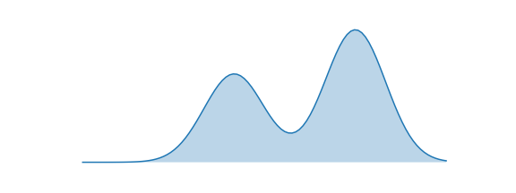
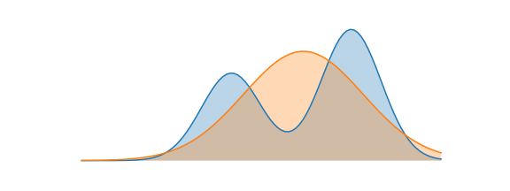
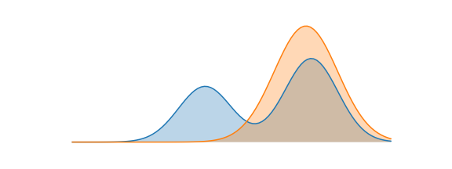

This post will talk about the **Kullback-Leibler Divergence** from a holistic perspective of reinforcement learning and machine learning. You've probably run into KL divergences before: especially if you've played with deep generative models like VAEs. Put simply, the KL divergence between two probability distributions measures how different the two distributions are.

I'll introduce the definition of the KL divergence and various interpretations of the KL divergence. Most importantly, I'll argue the following fact:

> Both the problems of supervised learning and reinforcement learning are simply minimizing the KL divergence objective

## What's the KL Divergence?

The *Kullback-Leibler divergence* (hereafter written as KL divergence) is a measure of how a probability distribution differs from another probability distribution. Classically, in Bayesian theory, there is some *true distribution* $P(X)$; we'd like to estimate with an *approximate distribution* $Q(X)$. In this context, the KL divergence measures the distance from the approximate distribution $Q$ to the true distribution $P$.

Mathematically, consider two probability distributions $P,Q$ on some space $\mathcal{X}$. The Kullback-Leibler divergence from $Q$ to $P$ (written as $D_{KL}(P \| Q)$)

$$D_{KL}(P \| Q) = \mathbb{E}_{x \sim P}\left[\log \frac{P(X)}{Q(X)}\right]$$

### Properties of KL Divergence

There are some immediate notes that are worth pointing out about this definition.

The KL Divergence is **not symmetric**: that is $D_{KL}(P \| Q) \neq D_{KL}(Q \| P)$. As a result, it is also **not a distance metric**.

The KL Divergence can take on values in $[0,\infty]$. Particularly, if $P$ and $Q$ are the exact same distribution ($P \stackrel{a.e.}{=} Q$), then $D_{KL}(P \| Q) = 0$, and by symmetry $D_{KL}(Q \| P) = 0$. In fact, with a little bit of math, a stronger statement can be proven: if $D_{KL}(P \| Q) = 0$, then $P \stackrel{a.e.}{=} Q$.

In order for the KL divergence to be finite, the support of $P$ needs to be contained in the support of $Q$. If a point $x$ exists with $Q(x) = 0$ but $P(x) > 0$, then $D_{KL}(P \| Q) = \infty$

### Rewriting the Objective

With some algebra, we can manipulate the definition of KL divergence in terms of other quantities. The most useful such manipulation is:

$$D_{KL}(P \| Q) = \mathbb{E}_{x \sim P}[-\log Q(X)] - \mathcal{H}(P(X))$$

Here, $\mathbb{E}_{x \sim P}[-\log Q(X)]$ is the *cross entropy* between $P$ and $Q$ (and denoted $H(p,q)$). The second term $\mathcal{H}(P(X))=\mathbb{E}_{x \sim p}[-\log p(x)]$ is the *entropy* of $P$.

## Forward and Reverse KL

Let's place ourselves in the optimization setting. There is some true distribution $P(X)$ that we're trying to estimate with our approximate distribution $Q_\theta(X)$. I'm using $\theta$ as a parameter here to explicitly emphasize that $Q$ is the distribution that we get to control.

As we mentioned earlier, the KL divergence is not a symmetric measure (i.e. that $D_{KL}(P \| Q) \neq D_{KL}(Q \| P)$). As a result, when trying to approximate $P$, we have a choice between two potential objectives to optimize.

1.  Minimizing the **forward KL**: $\arg\min_{\theta} D_{KL}(P\|Q_\theta)$
2.  Minimizing the **reverse KL**: $\arg\min_{\theta} D_{KL}(Q_\theta\|P)$

As it turns out, the two different objectives actually cause different types of approximations. We'll spend the next section discussing the qualitative behaviours of each approach. We'll investigate in the following setting: $P(X)$ is the bimodal distribution below. We'll try to approximate this with a normal distribution $Q(X) = \mathcal{N}(\mu, \sigma^2)$.

### Forward KL: Mean-Seeking Behaviour

Let's consider optimizing the forward KL objective with respect to $Q_{\theta}$

Notice that this is identical to the maximum likelihood estimation objective. Translated into words, the objective above will sample points from $P(X)$ and try to maximize the probability of these points under $Q(X)$. A good approximation under the forward KL objective thus satisfies

> Wherever $P(\cdot)$ has high probability, $Q(\cdot)$ must also have high probability.

We consider this *mean-seeking* behaviour, because the approximate distribution $Q$ must cover all the modes and regions of high probability in $P$. The optimal "approximate" distribution for our example is shown below. Notice that the approximate distribution centers itself between the two modes, so that it can have high coverage of both. The forward KL divergence does not penalize $Q$ for having high probability mass where $P$ does not.

### Reverse KL: Mode-Seeking Behaviour

Now consider optimizing the reverse KL objective with respect to $Q_{\theta}$

Let's translate the objective above into words. The objective above will sample points from $Q(X)$ and try to maximize the probability of these points under $P(X)$. The entropy term encourages the approximate distribution to be as wide as possible. A good approximation under the reverse KL objective thus satisfies

> Wherever $Q(\cdot)$ has high probability, $P(\cdot)$ must also have high probability.

We consider this *mode-seeking* behaviour, because any sample from the approximate distribution $Q$ must lie within a mode of $P$ (since it's required that samples from $Q$ have high probability under $P$). Notice that unlike the forward KL objective, there's nothing requiring the approximate distribution to try to cover all the modes. The entropy term prevents the approximate distribution from collapsing to a very narrow mode; typically, behaviour when optimizing this objective is to find a mode of $P$ with high probability and wide support, and mimic it exactly.

The optimal "approximate" distribution for our example is shown below. Notice that the approximate distribution essentially encompasses the right mode of $P$. The reverse KL divergence does not penalize $Q$ for not placing probability mass on the other mode of $P$.

### Which one should I use?

In this toy example, because we knew the exact distribution of $P$, we were able to show the behaviour of minimizing the forward and reverse KL divergences. In practice, it's often not possible to do both, and you are limited by domain to only one.

#### Forward KL

Recall that the simplified objective for the forward KL objective was

$$\arg\max_{\theta} \mathbb{E}_{x \sim P}[\log Q_\theta(X)]$$

To be able to evaluate this objective, we need either a dataset of samples from the true model $P(X)$, or a mechanism for sampling from the true model.

#### Reverse KL

The simplified objective for the forward KL objective was

$$\arg\max_{\theta} \mathbb{E}_{x \sim Q_\theta}[\log P(X)] + \mathcal{H}(Q_{\theta}(X))$$

To be able to evaluate this objective, we need to be able to evaluate probabilities of data-points under the true model $P(X)$

## Supervised Learning = Forward KL

Recall in supervised learning (empirical risk minimization), we have a dataset of samples $\mathcal{D} = \{(x_i,y_i)\}$ from some ground-truth data distribution $P(x,y) = P(x)P(y|x)$.

Our goal in supervised learning is to learn a model $f: \mathcal{X} \to \mathcal{Y}$ that minimizes the empirical risk of the model, which is parametrized by a loss function $L(f(x),y)$. In particular, we optimize over some distribution of models $f_\theta$

$$\arg\min_{\theta} \mathbb{E}_{(x,y) \sim \mathcal{D}}[L(f_\theta(x),y)]$$

We'll show that optimizing this objective is equivalent to minimizing the divergence from an approximate distribution $q_\theta(y|x)$ to the true data distribution $p(y|x)$. For reference, the forward KL divergence objective is
$$\arg\min_{\theta} \mathbb{E}_{x,y \sim \mathcal{D}}[-\log Q_\theta(y|x)]$$

-   **Classification with Cross-Entropy Loss**: Here, our approximate distribution $q_{\theta}(y|x)$ is a discrete distribution parametrized by a probability vector $p$ which is outputted by a neural network $f_{\theta}(x)$. By definition, the cross-entropy loss is exactly what the KL divergence minimizes.
-   **Regression with Mean-Squared Error Loss**: Here, our approximate distribution $q_{\theta}(y|x)$ is distributed normally $\mathcal{N}(f_{\theta}(x), I)$, where the mean of the distribution is parametrized by a neural network. The negative log-likelihood of the normal distribution is written below. Minimizing the NLL of this normal distribution is clearly equivalent to the mean-squared error loss.

$$-\log q(y|x) = -\frac{1}{2}\|y - f_{\theta}(x)\|_2^2 + C$$

This concept can in fact be extended to many other losses (for example, absolute error corresponds to the Laplace distribution). In particular, the forward KL divergence loss corresponds exactly to the problem of *maximum-likelihood estimation* which is the primary basis for many supervised learning problems.

## Reinforcement Learning = Reverse KL

Viewing the problem of reinforcement learning as minimizing the reverse KL objective requires us to think about reinforcement learning from a probabilistic perspective. For a good intro on why we want to do that, and how exactly we formulate it, check out my [control as inference guide](rl/controlasinference.html).

We can imagine that there's a distribution of optimal trajectories, given by $P_{opt}(\tau)$. Our goal in reinforcement learning is to learn stochastic policies $\pi(a|s)$ that induce a distribution over trajectories: $q_{\pi}(\tau)$. Now, we can't sample directly from the distribution of optimal trajectories $P_{opt}(\tau)$, but we know that the probability of a trajectory under optimality is exponential in the sum of rewards received on the trajectory.

$$\log P(\tau) = \sum_{t=1}^T r(s_t,a_t)$$

Optimizing the reverse KL objective then is

This is exactly the maximum-entropy reinforcement learning objective!

### Summary

KL divergences show up everywhere in machine learning, and a solid foundation in what the KL divergence measures is very useful. If you're interested in learning more about applications of KL divergence in statistics, I'd recommend reading articles on bayesian inference. KL divergence also has a very rich history in information theory: the [following](http://colah.github.io/posts/2015-09-Visual-Information/) are [great](https://www.wiley.com/en-us/Elements+of+Information+Theory%2C+2nd+Edition-p-9780471241959) [reads](http://www.inference.org.uk/itprnn/book.html). If you love deep learning, two very important concepts in the field using KL divergences right now are [VAEs](https://arxiv.org/abs/1312.6114) and [information bottlenecks](https://arxiv.org/abs/1503.02406).

As always, if you catch an error, shoot me an email at `dibya` @ `berkeley.edu` or comment below.
